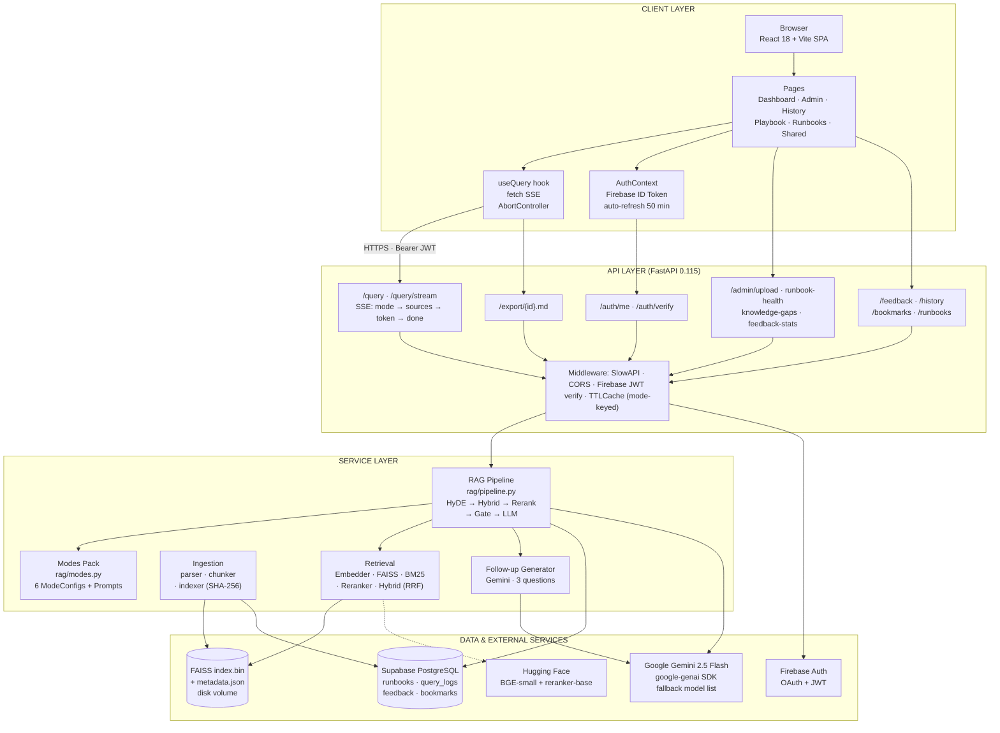
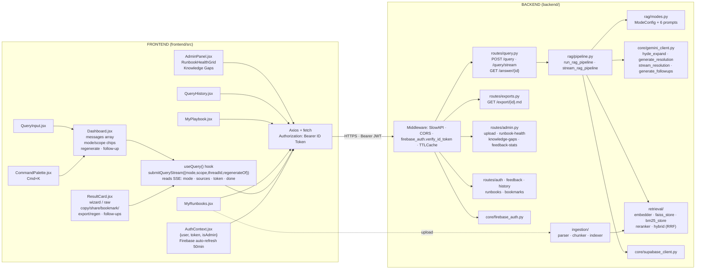
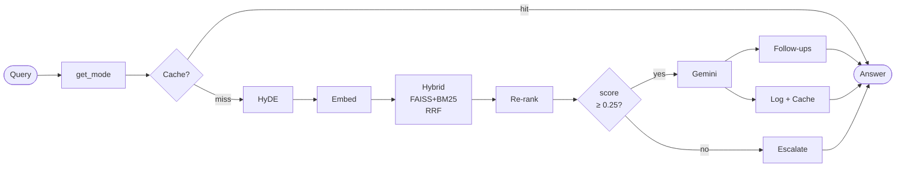
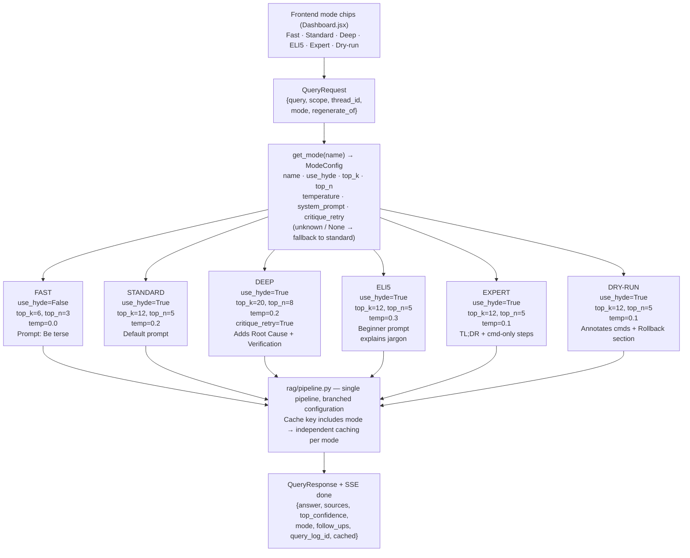
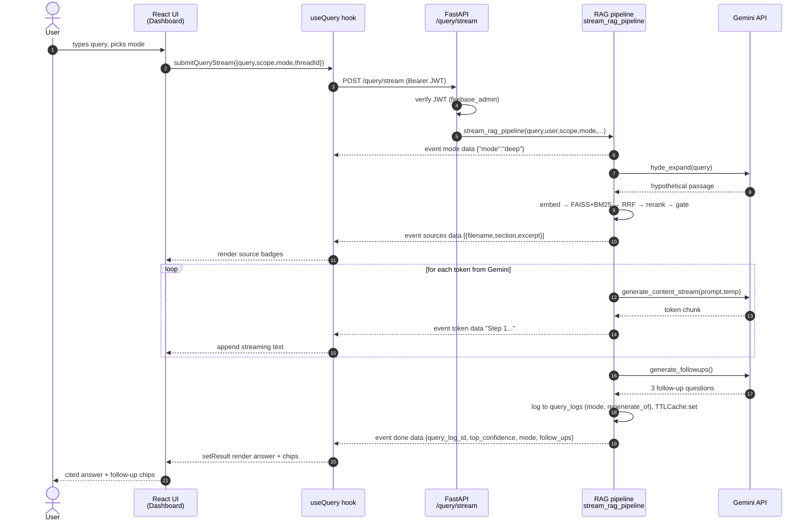
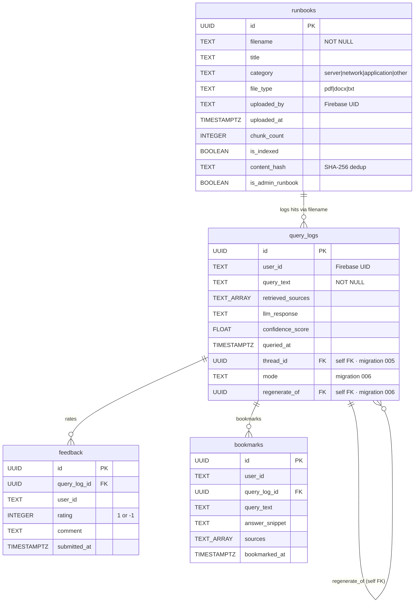
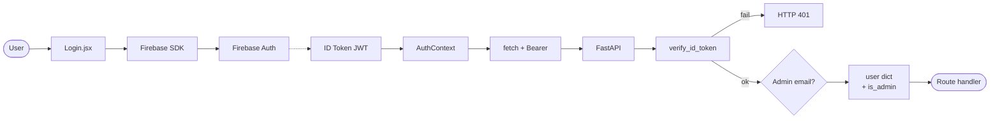
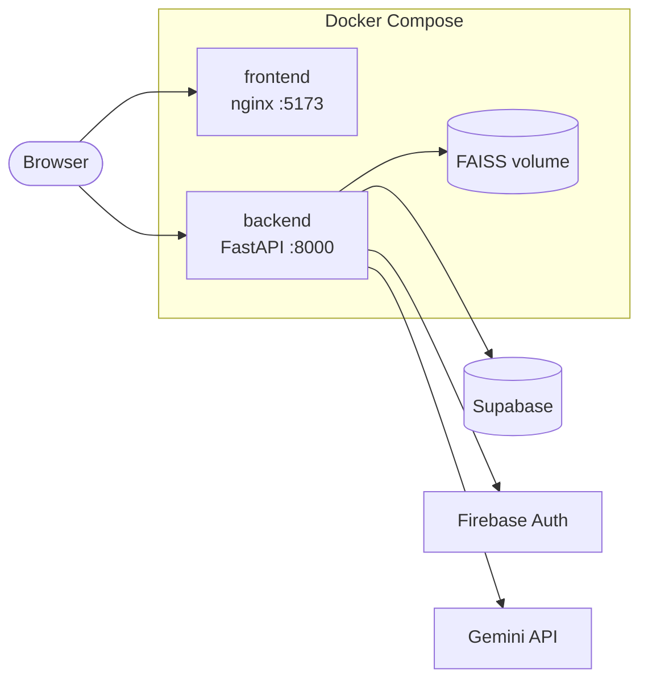

# ResolveIT AI — Mermaid Diagrams (paste into draw.io)

> In draw.io: **Arrange → Insert → Advanced → Mermaid…** then paste each block.
> All diagrams render fine without colours; tweak fonts/positions inside draw.io after insertion.

---

## Diagram 1 — High-Level System Architecture



---

## Diagram 2 — Component Interaction (React ↔ FastAPI ↔ Services)



---

## Diagram 3 — RAG Pipeline Flow



---

## Diagram 4 — Mode Selection & Pipeline Branching



---

## Diagram 5 — Streaming SSE Sequence



---

## Diagram 6 — Database ER



---

## Diagram 7 — Authentication Flow



---

## Diagram 8 — Deployment Topology



---

## How to use these in draw.io

1. Open **draw.io desktop** or **app.diagrams.net**.
2. **Arrange → Insert → Advanced → Mermaid…**
3. Paste a single fenced-block (the code between the ` ```mermaid ` markers, **not including** the markers).
4. Click **Insert** — draw.io renders editable shapes.
5. Re-arrange / restyle (font, alignment) as needed.
6. **File → Export As → PNG** (or SVG) to drop into the DOCX placeholders.

> draw.io supports `flowchart`, `sequenceDiagram`, and `erDiagram` in its built-in Mermaid importer. All 8 diagrams above use these supported types only.
